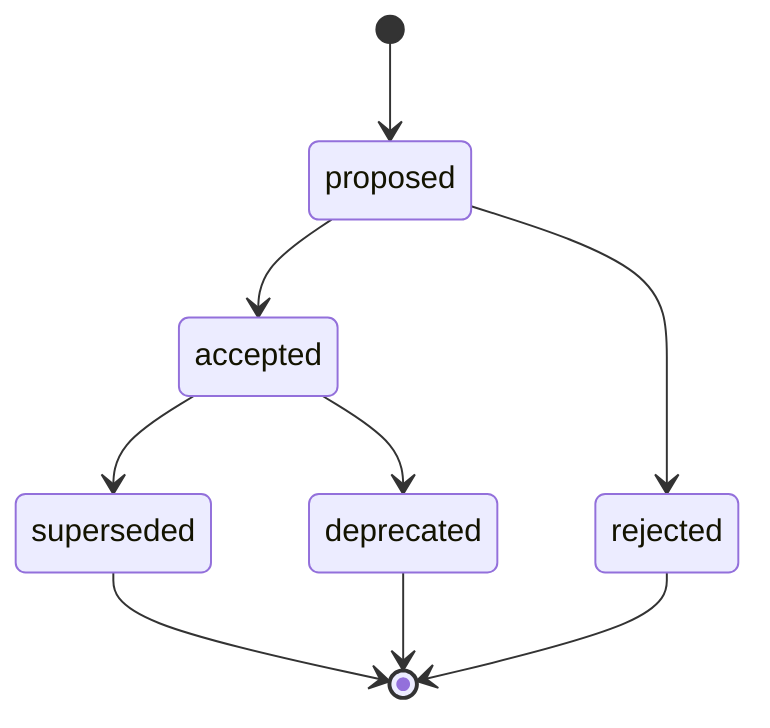

# Architecture Decision Records (ADR)

Un **Architecture Decision Record** capture une décision d'architecture
importante : le contexte qui l'a rendue nécessaire, les options envisagées, la
décision retenue et ses conséquences. L'objectif est qu'un lecteur — futur
collègue, ou moi-même dans six mois — comprenne _pourquoi_ le système est fait
ainsi, sans avoir à reconstituer le raisonnement.

## Conventions

- **Format** — [MADR 3.0](https://adr.github.io/madr/) (Markdown Any Decision
  Record). Le gabarit vierge est l'[ADR 0000](./0000-madr-template).
- **Numérotation** — un identifiant à quatre chiffres, incrémental et jamais
  réutilisé (`0001`, `0002`, …). Le nom de fichier est `NNNN-titre-en-kebab.mdx`.
- **Immuabilité** — une fois une décision `accepted`, on ne la réécrit pas. Si
  elle change, on crée un **nouvel** ADR qui la remplace, et on passe l'ancien à
  `superseded` en pointant vers le successeur.
- **Statut** — porté par le frontmatter `status` : `proposed`, `accepted`,
  `rejected`, `deprecated` ou `superseded`.

## Cycle de vie

## Créer un nouvel ADR

1. Copier l'[ADR 0000](./0000-madr-template) sous le prochain numéro libre.
2. Renseigner le frontmatter (`status: proposed`, la date, les décideurs).
3. Remplir le contexte, les options et la décision.
4. Une fois validée, passer le statut à `accepted`.

Le premier enregistrement, l'[ADR 0001](./0001-choix-generateur-docusaurus),
motive le choix de Docusaurus pour ce site — il sert aussi d'exemple concret.
