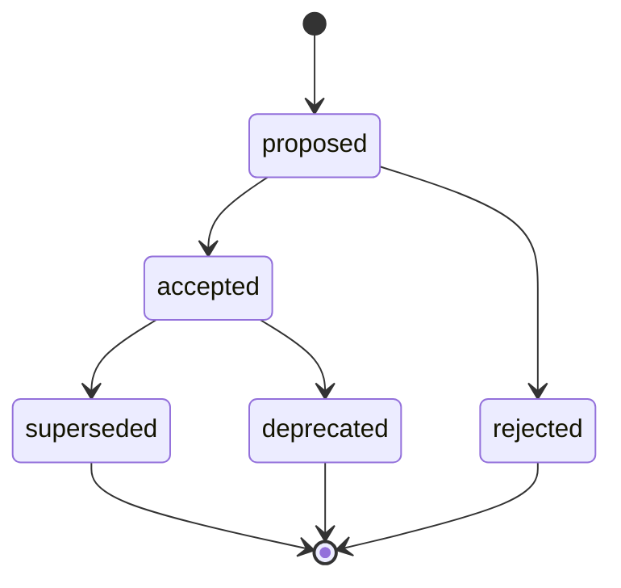

# Architecture Decision Records (ADR)

An **Architecture Decision Record** captures one significant architecture
decision: the context that made it necessary, the options considered, the choice
made, and its consequences. The goal is that a reader — a future colleague, or
myself in six months — can understand _why_ the system is shaped the way it is,
without reconstructing the reasoning from scratch.

## Conventions

- **Format** — [MADR 3.0](https://adr.github.io/madr/) (Markdown Any Decision
  Record). The blank template is [ADR 0000](./0000-madr-template).
- **Numbering** — a four-digit, incrementing identifier that is never reused
  (`0001`, `0002`, …). The file name is `NNNN-title-in-kebab.mdx`.
- **Immutability** — once a decision is `accepted`, it is not rewritten. If it
  changes, create a **new** ADR that supersedes it, and set the old one to
  `superseded`, pointing at its successor.
- **Status** — carried in the `status` frontmatter field: `proposed`,
  `accepted`, `rejected`, `deprecated`, or `superseded`.

## Lifecycle

## Creating a new ADR

1. Copy [ADR 0000](./0000-madr-template) under the next free number.
2. Fill in the frontmatter (`status: proposed`, the date, the deciders).
3. Write the context, the options, and the decision.
4. Once validated, set the status to `accepted`.

The first record, [ADR 0001](./0001-choix-generateur-docusaurus), captures why
Docusaurus was chosen for this site — it also serves as a worked example.
