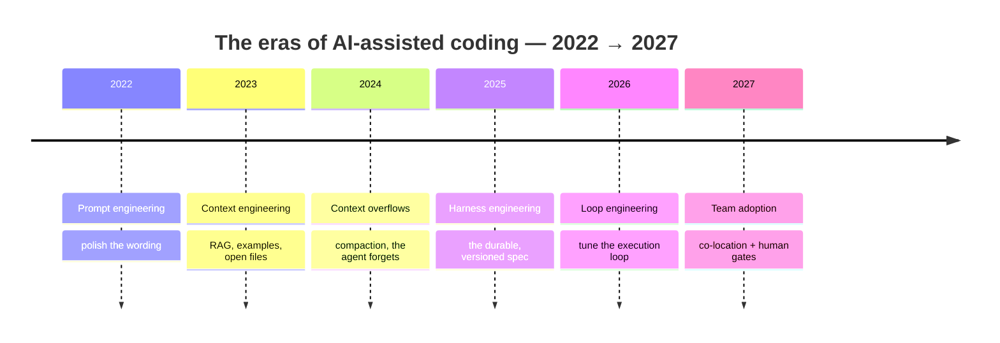
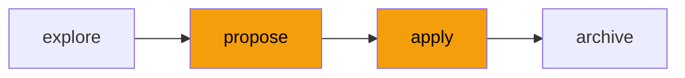
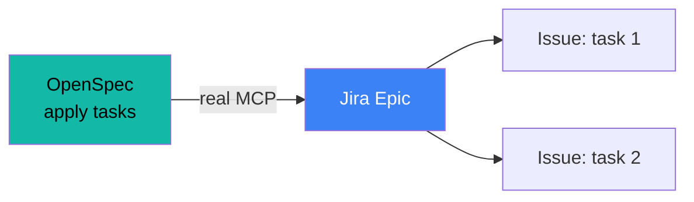
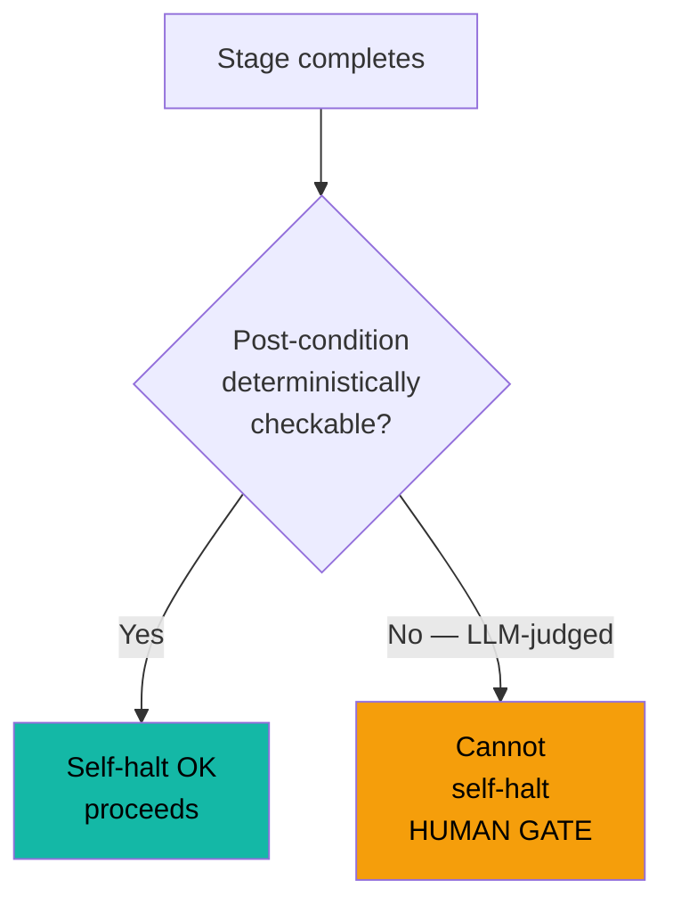

# AI-DLC × OpenSpec

**Staying in control** when the AI writes the code

Not "one more method." An answer to a question you already ask yourself: 
<b>how do I stay accountable for code I didn't type?</b>

Product Owner · Developer · Tech Lead · Architect — ~30 min, live demo at the end

<!--
Cold open. Do NOT start with "here is AI-DLC". Start with the real fear and flip
it: the AI that codes doesn't replace you, it shifts your work toward control.
This talk explains where that control sits. 1 min.
-->

---
layout: center
class: text-center
---

# You already know this pain

The agent starts well. 
Then, mid-way through a long task, it **forgets**. 
It redoes finished work, contradicts a decision made ten minutes ago.

This isn't a model bug. 
It's a <b>volatile-memory</b> problem — and it has a history.

<!--
Name a pain they've ALL lived before naming any method. Don't say "OpenSpec fixes
this" here — just plant the symptom. We return to it at the harness slide. 1-2 min.
-->

---
layout: section
---

# 1 · Four eras

Prompt engineering → context engineering → **harness engineering** → loop engineering.

Each era answers the **memory volatility** of the one before.

Each era appears because the previous one had a blind spot — something it couldn't preserve. 
Today we're at the "harness" stage: write the spec before the code. The rest (automating the loop, then scaling to the team) comes once this foundation is solid.

---
layout: center
hide: true
---

---
layout: two-cols-header
---

# Prompt engineering

We polish the **wording**. Rephrase, assign the role, structure the ask.

 {class="mx-auto block h-[200px]"}

::left::

- The lever: quality of the question
- A real gain — a good prompt beats a bad one

::right::

**The wall**: the model knows nothing about _your_ code, _your_ conventions, _your_ past decisions.

No rewording compensates for ignorance. The prompt is **volatile**: sent, then gone.

<!--
Stress the wall, not the technique. The wall justifies the next era.
"You can't prompt your way out of not knowing the context." 2 min.
-->

---
layout: two-cols-header
---

# Context engineering

We **inject** the right context: RAG, examples, open files, docs.

 {class="mx-auto block h-[200px]"}

::left::

- The lever: what the model has in front of it
- The agent finally knows **your** project: your code, your conventions, your architecture decisions — not a generic answer

::right::

**The wall**: on a long task, context **overflows**. It compacts, and the agent forgets.

That's the pain from slide 2. Context is **volatile** too — just one level up.

<!--
This is where we tie back to the cold open. "That's why your agent forgets:
context isn't memory, it's a window that empties." 2 min.
-->

---
layout: two-cols-header
---

# Harness engineering

We **externalize** intent and state into **durable, versioned** artifacts: the spec.

 {class="mx-auto block" width=600}

::left::

<v-clicks>

- The spec is **not** one more context — context lives *inside* the model's window and disappears; the spec lives *alongside* it, in the repo, on the developer's local disk
- It's not injected permanently: the agent **re-reads the spec on demand** — at the start of each stage, after compaction, when in doubt or conflict
- Diffable, PR-reviewed or reviewed in a meeting, clear accountability

</v-clicks>

::right::

**The unlock**: memory stops being volatile. The agent re-reads the spec when it needs it.

This is why **OpenSpec**, **Spec-Kit** and their kin exist: several teams converged on the same move — _write the spec before the code_.

OpenSpec and Spec-Kit are the two incarnations validated internally.

<!--
The top of the arc. The harness isn't "process": it's the only known answer to
volatility. Lineage, NOT comparison — if someone asks "why not X", defer to the
annex / Q&A. 3 min.
-->

---
layout: two-cols-header
---

# What's next? Loop engineering

The next step of the arc — **not for us today, but that's where we're headed**.

 {class="mx-auto block" width=600}

::left::

Once intent is stabilized (the harness), you stabilize the **loop** itself: design the execution harness as a first-class object — tools, checks, retries — fit to a class of tasks.

- The agent no longer just follows a spec
- You **tune the loop**: which tools, which deterministic checks, when to retry

::right::

**Why not now**: loop engineering assumes maturity — evals in place, tasks repetitive enough to justify the investment, tolerance for autonomy.

We're starting out: harness and co-location first. The autonomous loop comes when trust and evals are there.

prompt → context → harness → <b>loop</b>. We stop at harness; we keep the heading.

<!--
"Horizon" slide: show we know what's next without pretending we're there. Defuses
the "what about fully-autonomous agents?" — answer: yes, later, when evals and trust
are there. Do NOT sell loop engineering; place it. Ref: LangChain,
"The Art of Loop Engineering". 1-2 min.
-->

---
layout: default
---

# AI-DLC: the method and its 10 principles

AI-DLC (AI-Driven Development Lifecycle, Raja SP / AWS, 2025) is a **method**, not a tool: AI becomes a central collaborator, the human states intent and keeps control at the moments that matter. OpenSpec is one incarnation of it.

<b class="text-teal-500">1 · Reimagine, don't retrofit</b> 
AI is a core participant, not a bolt-on tool — design an AI-native SDLC.

<b class="text-blue-400">2 · Reverse the conversation</b> 
Human states <i>intent</i>; AI plans, asks, executes, validates — seeking approval.

<b class="text-blue-400">3 · Design techniques in the core</b> 
DDD / BDD / TDD become part of the method, not team-optional.

<b class="text-amber-500">4 · Align with AI capability</b> 
AI can't be 100% autonomous — <b>human-in-the-loop</b> validation and oversight.

<b class="text-teal-500">5 · Build complex systems</b> 
Preserve full project context — services, stakeholders, tech debt — end to end.

<b class="text-blue-400">6 · Retain human symbiosis</b> 
Keep continuous feedback where humans add judgment; automate + document touchpoints.

<b class="text-teal-500">7 · Transition through familiarity</b> 
Adopt gradually, integrating with concepts teams already know.

<b class="text-teal-500">8 · Streamline responsibilities</b> 
AI holds context across disciplines → integrated teams, fewer handoffs.

<b class="text-teal-500">9 · Minimize stages, maximize flow</b> 
Blur phase boundaries — continuous, non-linear, shorter feedback loops.

<b class="text-amber-500">10 · No hard-wired workflows</b> 
Adaptive — AI generates a custom workflow per project's goals & constraints.

Amber = the two principles this talk leans on: <b>#4</b> puts the human at the gate, <b>#10</b> is why OpenSpec (not a fixed pipeline) carries the flow. · Source: <b>IBM Think — "The AI-DLC"</b>, from Raja SP's AI-DLC Method Definition whitepaper.

<!--
"What is the method" grounding before the vibe/spec frontier. The 10 principles come
from Raja SP's whitepaper via IBM Think — same cards as the five-role deck, for
consistency. Stress #4 (the gate) and #10 (no fixed pipeline, hence OpenSpec). ~2 min.
-->

---
layout: section
---

# 2 · Where we're headed

Before showing, let's state the **destination**.

---
layout: two-cols-header
---

# OpenSpec at a glance

`explore` → `propose` → `apply` → `archive`. Four stages, two gates.

::left::

- **`explore`** — frame, sketch (reversible)
- **`propose`** — the change proposal → **Architect gate**
- **`apply`** — break down + execute → **Tech Lead gate** at entry
- **`archive`** — fold into the baseline

::right::

Trimmed view. The full five-role table comes once the team is convinced.

<!--
We do NOT teach the whole checkpoint map here — just the two gates that carry the
demo. The five-role deck is the "deck 2" of the widening phase. 2 min.
-->

---
layout: default
---

# Who does what in OpenSpec?

Four roles, four stages — each gate is held by the person who can judge.

<table class="text-xs w-full border-collapse">
<thead>
<tr>
  <th class="border border-gray-500/30 px-3 py-2 text-left bg-gray-500/10">Stage</th>
  <th class="border border-gray-500/30 px-3 py-2 text-center bg-teal-500/10 text-teal-400">Product Owner</th>
  <th class="border border-gray-500/30 px-3 py-2 text-center bg-amber-500/10 text-amber-400">Architect</th>
  <th class="border border-gray-500/30 px-3 py-2 text-center bg-blue-500/10 text-blue-400">Tech Lead</th>
  <th class="border border-gray-500/30 px-3 py-2 text-center bg-purple-500/10 text-purple-400">Developer</th>
</tr>
</thead>
<tbody>
<tr>
  <td class="border border-gray-500/30 px-3 py-2 font-mono font-bold">explore</td>
  <td class="border border-gray-500/30 px-3 py-2 text-center">States business intent, defines success criteria</td>
  <td class="border border-gray-500/30 px-3 py-2 text-center">Sketches technical constraints and risks</td>
  <td class="border border-gray-500/30 px-3 py-2 text-center">Identifies dependencies and impact on existing code</td>
  <td class="border border-gray-500/30 px-3 py-2 text-center opacity-40">—</td>
</tr>
<tr class="bg-amber-500/5">
  <td class="border border-gray-500/30 px-3 py-2 font-mono font-bold">propose ▲ gate</td>
  <td class="border border-gray-500/30 px-3 py-2 text-center">Validates alignment with business needs</td>
  <td class="border border-gray-500/30 px-3 py-2 text-center font-semibold text-amber-400">Approves or rejects the proposal — <b>decision gate</b></td>
  <td class="border border-gray-500/30 px-3 py-2 text-center opacity-40">—</td>
  <td class="border border-gray-500/30 px-3 py-2 text-center opacity-40">—</td>
</tr>
<tr class="bg-amber-500/5">
  <td class="border border-gray-500/30 px-3 py-2 font-mono font-bold">apply ▲ gate</td>
  <td class="border border-gray-500/30 px-3 py-2 text-center opacity-40">—</td>
  <td class="border border-gray-500/30 px-3 py-2 text-center">Available for arbitration if design conflict arises</td>
  <td class="border border-gray-500/30 px-3 py-2 text-center font-semibold text-amber-400">Validates task breakdown — <b>entry gate</b></td>
  <td class="border border-gray-500/30 px-3 py-2 text-center">Executes tasks from tickets, escalates blockers</td>
</tr>
<tr>
  <td class="border border-gray-500/30 px-3 py-2 font-mono font-bold">archive</td>
  <td class="border border-gray-500/30 px-3 py-2 text-center">Confirms the deliverable meets the original intent</td>
  <td class="border border-gray-500/30 px-3 py-2 text-center">Folds decisions into the architecture baseline</td>
  <td class="border border-gray-500/30 px-3 py-2 text-center">Merges the PR, updates technical documentation</td>
  <td class="border border-gray-500/30 px-3 py-2 text-center">Closes tickets, signs off on tests</td>
</tr>
</tbody>
</table>

Amber = human gates. A gate without the right person present is an empty rubber stamp.

<!--
The most operational slide in the deck. Name who does what, not just the stages.
Stress the two amber rows: propose = Architect says yes or no;
apply = Tech Lead validates the breakdown is executable BEFORE devs start.
The PO appears at explore and archive — they frame and they accept. 3 min.
-->

---
layout: two-cols-header
---

# Co-location is the point

A gate is worth nothing unless the person who can judge is **present when it fires**.

::left::

<v-clicks>

- The `propose` gate with no Architect present = an empty rubber stamp
- The `apply` gate with no Tech Lead = an unvalidated breakdown going to execution
- The spec is truth; stakeholders meet **at the stages**, not at the end

</v-clicks>

::right::

This is the real thesis of the demo: **not a tool, a practice**.

The agent produces; the human judges at the stage; the validated plan goes into **Jira**; the team executes.

<!--
The core of what we advocate (answer Q9). Co-location isn't optional: it's what
makes the gate real. The demo will PROVE it live. 2 min.
-->

---
layout: section
---

# 3 · Live demo

OpenSpec from `explore` to `archive`, gate visible, **real** Jira hand-off.

---
layout: two-cols-header
---

# What the demo proves

A real change, on our code. The `propose` gate is the climax.

::left::

1. `explore` → the agent frames
2. `propose` → the agent drafts the proposal
3. **Gate** → the Architect judges, present, live
4. `apply` → breakdown → **Tech Lead gate**
5. Validated plan → **real Jira issue** via MCP
6. The dev team executes from the issue

::right::

Real hand-off — not a mock. This is the money shot.

<!--
OpenSpec is slow to run: SCRIPT the path ahead of time, show live only the moments
that matter (the propose gate, the issue appearing). The Jira hand-off is REAL
(decision Q10a) — hence the safety-net slide that follows. 6-8 min.
-->

---
layout: center
class: text-center
---

# Safety net

If the live hand-off breaks (auth, network, API): 
<b>pre-recorded clip</b> + <b>screenshot of an already-created issue</b>.

We stand for traceability: never a silent fake. If it's the fallback, we say so.

<!--
Backup slide — hidden unless the demo breaks. Do NOT play it if everything works.
Principle: show a real mechanism or honestly say we're on the fallback. An
unannounced faked hand-off would betray the very value we're selling. 0-1 min.
-->

---
layout: section
---

# 4 · So what now?

An inspiring meeting is worthless without **a concrete action**.

---
layout: center
class: text-center
---

# The 30-day ask

Pick **one** real upcoming change. 
Carry it from `explore` to `archive` in OpenSpec. 
**In a pair**: one convinced + one skeptic.

One case, carried to the end, produces the internal testimony that converts the rest — better than any slide.

<!--
The ask MUST be concrete and small (answer Q12). One change, one pair, to archive.
The convinced+skeptic pair is deliberate: the skeptic who buys in becomes the best
relay. That's the propagation loop. 2 min.
-->

---
layout: center
class: text-center
---

# Recap

**History** → prompt, context, harness: each answers the previous one's volatility 
**Principle** → gate where determinism ends 
**Co-location** → the gate is real only if the right judge is present 
**Your turn** → one change, one pair, to `archive`

Questions? · OpenSpec & Spec-Kit validated internally · Jira demo = real hand-off

<!--
Close + Q&A. Keep the tool comparison for Q&A if pushed.
Defer the fine-grained five-role mechanics to "deck 2". 1 min.
-->

---
layout: section
---

# Annex · Vibe or spec?

For Q&A if the question comes up.

---
layout: two-cols-header
---

# The frontier

The criterion isn't taste, it's **the cost of being wrong**.

::left::

**Vibe coding** — the cost of error is near zero

- Prototype, exploration, throwaway
- You're still finding _what_ to build
- Being wrong costs nothing: rerun

::right::

**Spec-driven** — the error is paid for

- Ships to prod, spans teams
- You know _what_ to build, it must be right
- Undoing is expensive: frame it first

Scope corollary: single-file/single-dev leans vibe; once it crosses modules or teams, spec.

<!--
The frontier is NOT arbitrary — the next slide shows it follows from a principle.
Here, just state the two regimes clearly. A vibe story and a spec story from our
own experience can illustrate. 2 min.
-->

---
layout: two-cols-header
---

# Why the frontier is principled

Same rule as autonomous AI itself: the **self-halt rule**.

::left::

A stage may run **unattended** only if its post-conditions are **deterministically checkable**.

- Vibe: no post-condition that matters → let it run
- Spec: the error is paid for → human gate where determinism ends

::right::

<!--
Slide borrowed from the five-role deck. It's the bridge: the vibe/spec frontier
IS the self-halt rule, one level up. Vibe = nothing to check; spec = must check,
so a human is needed at the right place. 3 min.
-->
