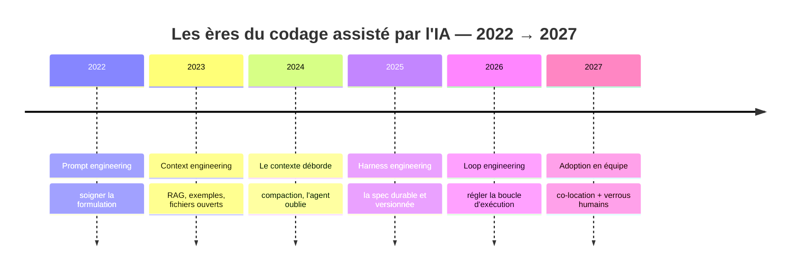
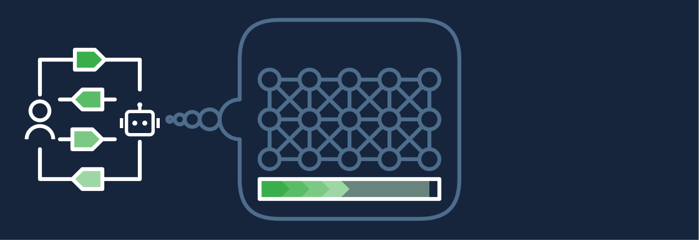
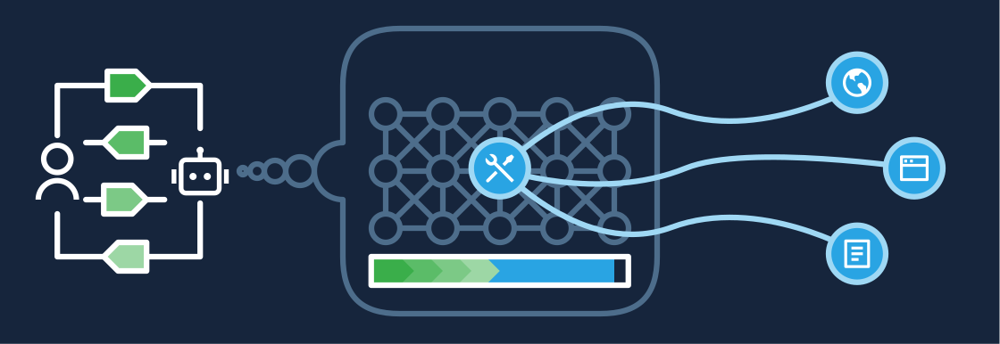
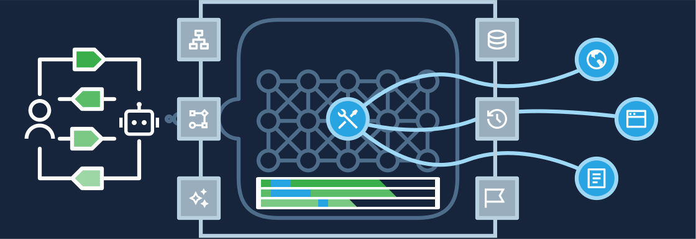
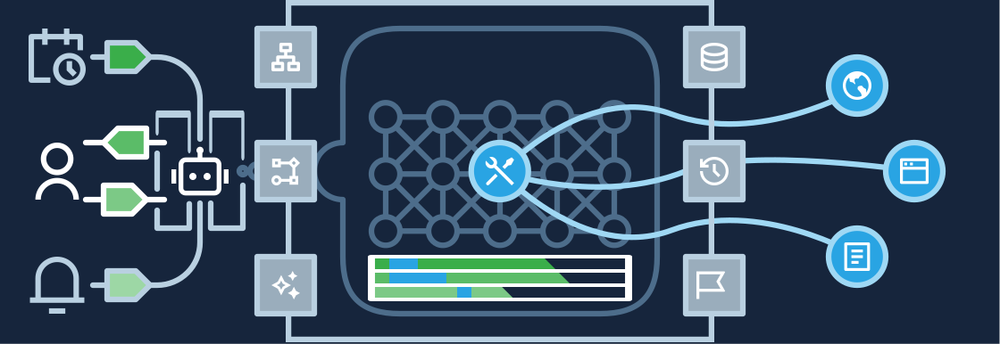
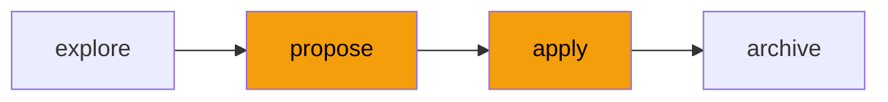
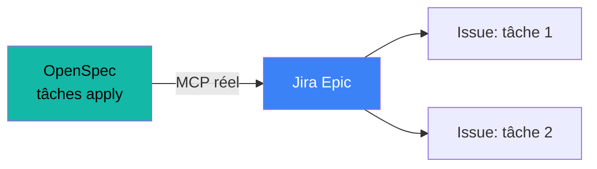
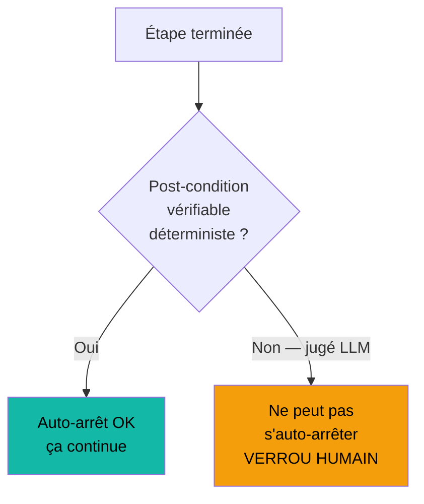

# Adopter le codage agentique

## Comment garder la main en équipe

quand l'IA écrit le code

Pas « une méthode de plus ». Une réponse à une question que vous vous posez déjà : 
<b>comment rester responsable d'un code que je n'ai pas tapé ?</b>

Product Owner · Développeur · Tech Lead · Architecte — ~30 min, démo live à la fin

<!--
Accroche à froid. NE PAS commencer par « voici AI-DLC ». Commencer par la peur
réelle et la retourner : l'IA qui code ne vous remplace pas, elle déplace votre
travail vers le contrôle. Ce talk explique où se place ce contrôle. 1 min.
-->

---
layout: center
class: text-center
---

# L'irritant que vous connaissez sans doutes déjà

L'agent démarre bien. Il analyse, suggère, clarifie, rédige. 
Puis, au milieu d'une tâche longue, il **oublie**. 
Il refait ce qui vous considériez comme était fait, contredit une décision prise dix minutes plus tôt.

Ce n'est pas un bug du modèle. 
C'est un problème d'<b>amnésie</b> des modèles de language actuel — et il a une histoire.

<!--
On nomme un irritant qu'ils ont TOUS vécu avant de nommer la moindre méthode.
Ne pas dire « OpenSpec règle ça » ici — juste poser le symptôme. On y reviendra
à la slide harness. 1-2 min.
-->

---
layout: section
---

# 1 · Quartre ères

Prompt engineering → context engineering → **harness engineering**  →  loop engineering.

Chaque ère répond à la **volatilité** mémorielle de la précédente.

Chaque ère naît de la volatilité que la précédente n'a pas su tenir. 
Nous, on ancre le harnais ; le loop puis l'adoption équipe sont le cap.

---
layout: center
hide: true
---

---
layout: two-cols-header
---

# Prompt engineering — soigner la formulation

On soigne la **formulation**. Reformuler, donner le rôle, structurer la demande.

 {class="mx-auto block h-[200px]"}

::left::

- Le levier : la qualité de la question
  - [RTF](https://www.youtube.com/watch?v=e_ZQcu535PI): Rôle  · Task  ·  Format
  - [CREATE](https://youtu.be/CuynTRSveLg?si=4YGga7VMEizcew8N): Character · Resquest · Example · Adjustment and constraints · Type of output · Evaluation steps
  - [COSTAR](https://www.youtube.com/watch?v=LE578lYq2iw): Context · Objective · Style · Tone · Audience · Response format
- Vrai gain, réel — un bon prompt bat un mauvais prompt

::right::

**Le mur** : le modèle ne sait rien de _votre_ code, _vos_ conventions, _vos_ décisions passées.

Aucune reformulation ne compense l'ignorance. Le prompt est **volatil** : envoyé, puis perdu.

<!--
Insister sur le mur, pas sur la technique. Le mur justifie l'ère suivante.
« On ne peut pas prompter sa sortie de l'ignorance du contexte. » 2 min.
-->

---
layout: two-cols-header
---

# Context engineering — injecter le contexte

On **injecte** le bon contexte : RAG, exemples, fichiers ouverts, documentation.

 {class="mx-auto block h-[200px]"}

::left::

- Le levier : ce que le modèle a sous les yeux
- L'agent connaît enfin **votre** projet : votre code, vos conventions, vos décisions d'architecture — pas une réponse générique

::right::

**Le mur** : sur une tâche longue, le contexte **déborde**. Il se compacte, et l'agent oublie.

C'est l'irritant de la slide 2. Le contexte est **volatil** aussi — juste un cran plus haut.

<!--
C'est ici qu'on relie au cold open. « Voilà pourquoi votre agent oublie : le
contexte n'est pas une mémoire, c'est une fenêtre qui se vide. » 2 min.
-->

---
layout: two-cols-header
---

# Harness engineering — externaliser l'intention

On **externalise** l'intention et l'état dans des artefacts **durables et versionnés** : la spec.

 {class="mx-auto block" width=600}

::left::

<v-clicks>

- La spec n'est **pas** un contexte de plus : _le contexte vit *dans* la fenêtre du modèle et disparaît ; la spec vit *à côté*, dans le repo, sur disque local du développeur_
- Elle n'est pas injectée en permanence : _l'agent la **relit la spec à la demande**, quand il en a besoin ; En début de tâche, après compaction, en cas de doute ou de conflit_
- Diffable, revue en PR ou en réunion, imputabilité claire

</v-clicks>

::right::

**Le déblocage** : la mémoire cesse d'être volatile. L'agent relit la spec quand il en a besoin.

C'est pour ça qu'existent **OpenSpec**, **Spec-Kit**, **BMAD**, **AI-DLC workflows** et consorts : l'industrie converge vers le même geste — _écrire la spec avant le code_.

OpenSpec et Spec-Kit sont les deux incarnations validées chez nous.

<!--
Le sommet de l'arc. Le harnais n'est pas « du process » : c'est la seule réponse
connue à la volatilité. Lignée, PAS comparatif — si quelqu'un demande « pourquoi
pas X », renvoyer à l'annexe / Q&R. 3 min.
-->

---
layout: two-cols-header
---

# L'étape d'après : loop engineering

L'étape suivante de l'arc — **pas pour nous aujourd'hui, mais c'est là qu'on va**.

 {class="mx-auto block" width=600}

::left::

Après avoir stabilisé l'intention (le harnais), on stabilise la **boucle** elle-même : concevoir le harnais d'exécution comme un objet à part entière — outils, vérifications, reprises — taillé pour une classe de tâches.

- L'agent ne se contente plus de suivre une spec
- On **règle la boucle** : quels outils, quelles vérifications déterministes, quand relancer

::right::

**Pourquoi pas maintenant** : le loop engineering suppose une maturité — evals en place, tâches assez répétitives pour valoir l'investissement, tolérance à l'autonomie.

Nous, on démarre : d'abord le harnais et la co-location. La boucle autonome viendra quand la confiance et les evals seront là.

prompt → context → harness → <b>loop</b>. On s'arrête à harness ; on garde le cap.

<!--
Slide « horizon » : montrer qu'on connaît la suite sans prétendre y être. Désamorce
le « et l'agent full-autonome ? » — réponse : oui, plus tard, quand les evals et la
confiance sont là. Ne PAS vendre le loop engineering ; le situer. Réf : LangChain,
« The Art of Loop Engineering ». 1-2 min.
-->

---
layout: default
---

# AI-DLC : la méthode et ses 10 principes

AI-DLC (AI-Driven Development Lifecycle, Raja SP / AWS, 2025) est une **méthode**, pas un outil : l'IA devient collaboratrice centrale, l'humain donne l'intention et garde le contrôle aux moments qui comptent. OpenSpec en est une incarnation.

<b class="text-teal-500">1 · Réinventer, pas rafistoler (retrofit)</b> 
L'IA est un participant central, pas un outil greffé — un SDLC pensé pour l'IA.

<b class="text-blue-400">2 · Inverser la conversation</b> 
L'humain énonce l'<i>intention</i> ; l'IA planifie, questionne, exécute, valide — et demande l'approbation.

<b class="text-blue-400">3 · Techniques de conception au cœur</b> 
DDD / BDD / TDD font partie de la méthode, pas d'une option d'équipe.

<b class="text-amber-500">4 · S'aligner sur la capacité de l'IA</b> 
L'IA n'est pas 100 % autonome — <b>humain dans la boucle</b>, validation et supervision.

<b class="text-teal-500">5 · Construire des systèmes complexes</b> 
Préserver tout le contexte projet — services, parties prenantes, dette — de bout en bout.

<b class="text-blue-400">6 · Garder la symbiose humaine</b> 
Maintenir le feedback continu là où l'humain apporte du jugement ; automatiser et documenter les points de contact.

<b class="text-teal-500">7 · Transitionner par la familiarité</b> 
Adopter la méthode progressivement, en s'appuyant sur des concepts déjà connus par les participants.

<b class="text-teal-500">8 · Simplifier les responsabilités</b> 
L'IA porte le contexte entre disciplines → équipes intégrées, moins de passations.

<b class="text-teal-500">9 · Minimiser les étapes, maximiser le flux</b> 
Estomper les frontières de phases — continu, non linéaire, boucles courtes.

<b class="text-amber-500">10 · Pas de workflow figé</b> 
Adaptatif — l'IA génère un workflow sur mesure selon les buts et contraintes du projet.

Ambre = les deux principes que ce talk exploite : <b>#4</b> place l'humain au verrou, <b>#10</b> explique pourquoi OpenSpec (et non un pipeline figé) porte le flux. · Source : <b>IBM Think — « The AI-DLC »</b>, d'après le whitepaper de Raja SP.

<!--
Fondation « c'est quoi la méthode » avant la frontière vibe/spec. Les 10 principes
viennent du whitepaper Raja SP via IBM Think — mêmes cartes que le deck cinq-rôles,
pour cohérence. Insister sur #4 (le verrou) et #10 (pas de pipeline figé, d'où
OpenSpec). ~2 min.
-->

---
layout: section
---

# 2 · La destination, avant la démo

Avant de montrer, disons **la destination**.

---
layout: two-cols-header
---

# OpenSpec en un coup d'œil

`explore` → `propose` → `apply` → `archive`. Quatre étapes, deux verrous.

::left::

- **`explore`** — cadrer, esquisser (réversible)
- **`propose`** — la proposition de changement → **verrou Architecte**
- **`apply`** — décomposer + exécuter → **verrou Tech Lead** en entrée
- **`archive`** — intégrer à la ligne de base

::right::

Vue resserrée. Le tableau complet des cinq rôles vient une fois l'équipe convaincue.

<!--
On n'apprend PAS tout le checkpoint map ici — juste les deux verrous qui portent
la démo. Le deck cinq-rôles est le « deck 2 » de la phase d'élargissement. 2 min.
-->

---
layout: default
---

# Qui fait quoi dans OpenSpec ?

Quatre rôles, quatre étapes — chaque verrou est tenu par la personne qui peut juger.

<table class="text-xs w-full border-collapse">
<thead>
<tr>
  <th class="border border-gray-500/30 px-3 py-2 text-left bg-gray-500/10">Étape</th>
  <th class="border border-gray-500/30 px-3 py-2 text-center bg-teal-500/10 text-teal-400">Product Owner</th>
  <th class="border border-gray-500/30 px-3 py-2 text-center bg-amber-500/10 text-amber-400">Architecte</th>
  <th class="border border-gray-500/30 px-3 py-2 text-center bg-blue-500/10 text-blue-400">Tech Lead</th>
  <th class="border border-gray-500/30 px-3 py-2 text-center bg-purple-500/10 text-purple-400">Développeur</th>
</tr>
</thead>
<tbody>
<tr>
  <td class="border border-gray-500/30 px-3 py-2 font-mono font-bold">explore</td>
  <td class="border border-gray-500/30 px-3 py-2 text-center">Formule l'intention métier, définit les critères de succès</td>
  <td class="border border-gray-500/30 px-3 py-2 text-center">Esquisse les contraintes techniques et les risques</td>
  <td class="border border-gray-500/30 px-3 py-2 text-center">Identifie les dépendances et l'impact sur l'existant</td>
  <td class="border border-gray-500/30 px-3 py-2 text-center opacity-40">—</td>
</tr>
<tr class="bg-amber-500/5">
  <td class="border border-gray-500/30 px-3 py-2 font-mono font-bold">propose ▲ verrou</td>
  <td class="border border-gray-500/30 px-3 py-2 text-center">Valide l'alignement avec les besoins métier</td>
  <td class="border border-gray-500/30 px-3 py-2 text-center font-semibold text-amber-400">Approuve ou rejette la proposition — <b>verrou décisionnel</b></td>
  <td class="border border-gray-500/30 px-3 py-2 text-center opacity-40">—</td>
  <td class="border border-gray-500/30 px-3 py-2 text-center opacity-40">—</td>
</tr>
<tr class="bg-amber-500/5">
  <td class="border border-gray-500/30 px-3 py-2 font-mono font-bold">apply ▲ verrou</td>
  <td class="border border-gray-500/30 px-3 py-2 text-center opacity-40">—</td>
  <td class="border border-gray-500/30 px-3 py-2 text-center">Disponible pour arbitrage si conflit de conception</td>
  <td class="border border-gray-500/30 px-3 py-2 text-center font-semibold text-amber-400">Valide la décomposition en tâches — <b>verrou d'entrée</b></td>
  <td class="border border-gray-500/30 px-3 py-2 text-center">Exécute les tâches depuis les tickets, remonte les blocages</td>
</tr>
<tr>
  <td class="border border-gray-500/30 px-3 py-2 font-mono font-bold">archive</td>
  <td class="border border-gray-500/30 px-3 py-2 text-center">Confirme que le livrable répond à l'intention initiale</td>
  <td class="border border-gray-500/30 px-3 py-2 text-center">Intègre les décisions à la ligne de base d'architecture</td>
  <td class="border border-gray-500/30 px-3 py-2 text-center">Merge la PR, met à jour la documentation technique</td>
  <td class="border border-gray-500/30 px-3 py-2 text-center">Clôture les tickets, valide les tests</td>
</tr>
</tbody>
</table>

Ambre = verrous humains. Un verrou sans la bonne personne présente est un tampon vide.

<!--
La slide la plus opérationnelle du deck. On nomme qui fait quoi, pas juste les étapes.
Insister sur les deux lignes ambrées : propose = l'Architecte dit oui ou non ;
apply = le Tech Lead valide que la décomposition est exécutable AVANT que les devs démarrent.
Le PO apparaît à explore et archive — il cadre et il réceptionne. 3 min.
-->

---
layout: two-cols-header
---

# La co-location, c'est tout le sujet

Un verrou ne vaut que si la personne qui peut juger est **présente quand il se déclenche**.

::left::

<v-clicks>

- Le verrou `propose` sans Architecte présent = un tampon vide
- Le verrou `apply` sans Tech Lead = une décomposition non validée qui part en exécution
- La spec est la vérité ; les parties prenantes se réunissent **aux étapes**, pas à la fin

</v-clicks>

::right::

C'est la vraie thèse de la démo : **pas un outil, une pratique**.

L'agent produit ; l'humain juge à l'étape ; le plan validé part dans **Jira** ; l'équipe exécute.

<!--
C'est le cœur de ce qu'on promeut (réponse Q9). La co-location n'est pas
optionnelle : c'est ce qui rend le verrou réel. La démo va le PROUVER en live. 2 min.
-->

---
layout: section
---

# 3 · Démo live

OpenSpec de `explore` à `archive`, verrou visible, hand-off Jira **réel**.

---
layout: two-cols-header
---

# Ce que la démo prouve

Un vrai changement, sur notre code. Le verrou `propose` est le point culminant.

::left::

1. `explore` → l'agent cadre
2. `propose` → l'agent rédige la proposition
3. **Verrou** → l'Architecte juge, présent, en direct
4. `apply` → décomposition → **verrou Tech Lead**
5. Le plan validé → **ticket Jira réel** via MCP
6. L'équipe de dev exécute depuis le ticket

::right::

Hand-off réel — pas une maquette. C'est le moment fort.

<!--
OpenSpec est long à exécuter : SCRIPTER le parcours à l'avance, ne montrer en
live que les moments qui comptent (le verrou propose, le ticket qui apparaît).
Le hand-off Jira est RÉEL (décision Q10a) — d'où la slide filet de sécurité qui
suit. 6-8 min.
-->

---
layout: center
class: text-center
---

# Filet de sécurité

Si le hand-off live casse (auth, réseau, API) : 
<b>clip pré-enregistré</b> + <b>capture d'un ticket déjà créé</b>.

On défend la traçabilité : jamais de faux silencieux. Si c'est le repli, on le dit.

<!--
Slide de secours — masquée sauf si la démo casse. Ne PAS la jouer si tout marche.
Le principe : montrer un vrai mécanisme ou dire honnêtement qu'on est en repli.
Un hand-off truqué non annoncé trahirait la valeur même qu'on vend. 0-1 min.
-->

---
layout: section
---

# 4 · Votre premier pas

Une réunion qui inspire ne vaut rien sans **une action concrète**.

---
layout: center
class: text-center
---

# La demande à 10 jours ouvrés

Choisir **un** vrai changement à venir. 
Le porter de `explore` à `archive` dans OpenSpec. 
**En binôme** : un convaincu + un sceptique.

Un seul cas, mené jusqu'au bout, produit le témoignage interne qui convertira le reste — mieux que n'importe quelle slide.

<!--
La demande DOIT être concrète et petite (réponse Q12). Un changement, un binôme,
jusqu'à archive. Le binôme convaincu+sceptique est délibéré : le sceptique qui
adhère devient le meilleur relais. C'est la boucle de propagation. 2 min.
-->

---
layout: center
class: text-center
---

# Récap

**Histoire** → prompt, context, harness : chacun répond à la volatilité du précédent 
**Principe** → verrouiller là où le déterminisme s'arrête 
**Co-location** → le verrou n'est réel que si le bon juge est présent 
**À vous** → un changement, un binôme, jusqu'à `archive`

Questions ? · OpenSpec & Spec-Kit validés en interne · démo Jira = hand-off réel

<!--
Clôture + Q&R. Garder le comparatif d'outils pour la Q&R si on pousse.
Reporter la mécanique fine des cinq rôles au « deck 2 ». 1 min.
-->

---
layout: section
---

# Annexe · Vibe ou spec ?

Pour aller plus loin si la question se pose en Q&R.

---
layout: two-cols-header
---

# La frontière : le coût de l'erreur

Le critère n'est pas le goût, c'est **le coût de l'erreur**.

::left::

**Vibe coding** — le coût de l'erreur est proche de zéro

- Prototype, exploration, jetable
- On cherche encore _quoi_ construire
- Se tromper ne coûte rien : on relance

::right::

**Spec-driven** — l'erreur se paie

- Va en prod, traverse des équipes
- On sait _quoi_ construire, il faut le faire juste
- Défaire coûte cher : on cadre avant

Corollaire de portée : mono-fichier/mono-dev penche vibe ; dès que ça traverse modules ou équipes, spec.

<!--
La frontière n'est PAS arbitraire — la slide suivante montre qu'elle découle
d'un principe. Ici, juste poser les deux régimes clairement. Un récit vibe et un
récit spec de notre vécu peuvent illustrer. 2 min.
-->

---
layout: two-cols-header
---

# La frontière n'est pas arbitraire

Même règle que l'IA autonome elle-même : la **règle de l'auto-arrêt**.

::left::

Une étape peut s'exécuter **sans surveillance** uniquement si ses post-conditions sont **vérifiables de façon déterministe**.

- Vibe : pas de post-condition qui compte → laisser courir
- Spec : l'erreur se paie → verrou humain là où le déterminisme s'arrête

::right::

<!--
Slide empruntée au deck cinq-rôles. C'est le pont : la frontière vibe/spec EST
la règle de l'auto-arrêt, remontée d'un cran. Vibe = rien à vérifier ; spec =
il faut vérifier, donc il faut un humain au bon endroit. 3 min.
-->
